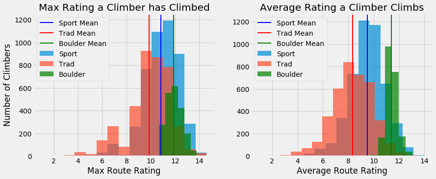
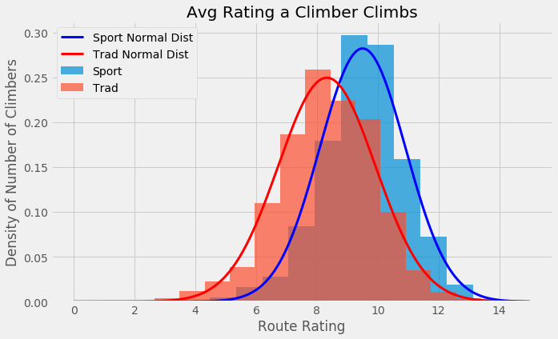

# What type of rock climbing is harder, trad or sport?
There are a myriad of different types of rock climbing, both indoors and outdoors. Among the most popular are trad (short for traditional) and sport climbing.

<!-- <table border="0"><tr>
    <td></td>
    <td></td>
</tr></table>

*Trad climber on the left, sport climber on the right. ([source](https://www.powercompanyclimbing.com/blog/2019/4/19/guest-post-chad-volk))* -->

Trad Climber           |  Sport Climber *([source](https://www.powercompanyclimbing.com/blog/2019/4/19/guest-post-chad-volk))*
:-------------------------:|:-------------------------:
  |  

Trad climbing involves placing your own protection as you lead the rope up to the top, and usually involves climbing in a crack where the gear can be placed. Sport climbing is oriented towards climbing on the face of the rock, where bolts are added to clip the rope into as protection. Both of these types of climbing, while very different, are rated on the same difficulty scale. It is a notorious notion in the climbing community that trad climbing is harder than sport climbing. Is this true? Are trad and sport different enough that they should be graded differently? Bouldering, which is another style of rock climbing, has its own difficulty scale, sho why don't trad or sport? This analysis is going to try to shed light on these questions.

---

## Mountain Project Data

The data for this project was collected from [Mountain Project](https://www.mountainproject.com/), a site designed for climbers to investigate climbing routes and track their climbs. There are thousands of climbers active on the site, with thousands of routes listed. Mountain project provides an [api](https://www.mountainproject.com/data) which provides data in a clean, nested map structure. However, collecting all of the data used in the project was not as simple as running a few api calls. The parameters for the calls are user Ids and route Ids, which are not readily listed. 

A workaround was required to get ahold of these Ids. One function of the api allowed for receiving routes based on geographic coordinates as parameters. This provided a set of routes that included route Ids and the url to each of the route pages. On those pages includes a list of climbers who rated those routes, along with links to their own personal page. I first called the coordinate-based route api and then web-scraped the user Ids from the voters on each of those routes to get a list of user Ids. With those Ids, I could use an api call to get data on all of the routes that those climbers had climbed. And finally, with that data, I could again call the api to get the route information with those route Ids. This data collection process can be seen in more detail on the [Data Collection page](https://github.com/redwin21/trad-vs-sport/tree/master/data_collection).

Due to the process required for collecting the data, only a small subset of the existing data on the site was collected. The primary focus was starting with routes in the Pacific Northwest, acquiring data on the climbers who voted on those routes, and going from there. This resulted in a dataset of about 80,000 routes, 8,000 climbers, and 500,000 climbs.

---

## What's in the data?

There are many types of rock climbing routes, including routes that are combinations of various types. Some of the most popular and distinct types are trad, sport, bouldering, TR (top-rope), alpine, aid, ice, and mixed. Of the data collected, trad, sport and bouldering are the most pupular. The project will focus mainly on these three.

    <td></td>

Currently in the U.S., roped climbing such as trad, sport, and TR are given a difficulty rating on the Yosemite Decimal Scale (YDS).  Bouldering is graded on the Vermin (V) scale. *([source](https://squamishclimbing.com/articles/grade-conversion-chart/))*

    <td></td>

A breakdown of the route ratings collected in the dataset shows that a lot of routes fall in the 5.7 to 5.12 range for rope climbing and V0-V5 for bouldering.

    <td></td>

The ratings were converted to a numerical rating based on the chart provided above. For instance, *5.6* would be 6.0, *5.11d* was given 11.8, *V5* is now 12.0, etc. This allowed for proper comparison and analysis. Distributions of trad, sport, and boulder routes based on their numerical rating can be seen in the following plots. Unfortunately, due to the numeric conversion of the ratings being based on discrete keys, the bin size for these histograms, and all following, have to be rather large, causing coarse plots.

The distributions of these types of climbing seem to suggest that sport ratings are generally higher than trad, or that more sport routes with higher ratings exist.

    <td></td>

We can get an idea of what type of climbing people favor based on the relationship between the routes *"stars"*, on a 0-5 scale, and the number of people who have made those votes, differentiated by type of climbing. It seems like, while more people have climbed sport in this dataset, they tend to rate trad routes higher. It also makes sense that the lower a route is rated, the less people would want to go climb it, meaning it would have less votes.

    <td></td>

We can see a similar perspective from a slightly different angle by looking at how many routes of a certain type a climber has climbed in our dataset. It seems like people tend to climb more sport, which coincides with the data that shows it is more abundant.

    <td></td>

All of this data seems to suggest that people climb sport more regularly, it is more available, and it is generally rated at higher ratings. If this is the case, it wouldn't be too much of a surprise that climbers are generally better at sport climbing on average.

---

## Lead or Follow, Send or Fall

To do a deeper dive into the main questions being addressed, we have to break down the data a little further. When a climber climbs a route, there are a handul of "styles" by which they can climb. Leading is the one that we care about, which is when a climber starts from the gound, attached to a loose rope, and clips the rope into protection on their way up. Climbers lead in both sport and trad, but not in bouldering since there is no rope involved. For the sake of consistent comparisons, we also only care about when a climber successfully and cleanly climbed the route by leading it, as opposed to attempting and failing or falling along the way. The lead style categories "flash", "onsight", and "redpoint" all mean a clean and successful climb.

    <td></td>

With the data broken down in this way, we can take another look at route difficulty. This time, it'll be differentiated by the number of climbs, as opposed to the number of routes we looked at earlier. The distinction here is that only one of each route exists, but many climbers have climbed each one. The failures seem to have higher difficulties than the successes, which makes sense, climbers push themselves.

    <td></td>

---

## Which is harder?

We won't be able to prove whether trad is harder than sport or not. There are so many factors that go into both styles. But we can look at the data in a way to show that climbers are inherently better at sport than trad, given the same difficulty rating. Better at sport would mean their sport rating statistics are higher than their trad rating statistics.

First, looking at the aggregate of the climbs grouped by each climber, we can see the distribution of their collective climbing ability. People tend to have a higher average sport rating than trad rating. People also tend to have a higher max sport rating than max trad rating (meaning the hardest rating of each style that they've climbed).

    <td></td>

When you look at the difference of a climbers sport and trad average, or sport and trad max, you can clearly see that for most climbers there is a difference. This plot is the sport rating minus the trad rating for each climber.

    <td></td>

Scaling the route rating distributions down to a density plot, we can fit a normal distribution curve to the data. Here we're only looking at the climber's average rating, although max would show a similar story. However, due to the central limit theorem, the averages are more likely to show a normal distribution.

    <td></td>

There are two perspectives of the data which we have looked at to do a hypothesis test about climbers' sport vs trad capability. One way was to turn the data into a boolean, where if a climber's rating is higher for sport, the value is true (1), otherwise it is false (0). Performing a z-test on the 0/1 data shows that for a large portion of the climbers, they climb harder sport routes on average. The z-test assumes the null hypothesis that there is no difference in ability (meaning an expectation of 0.5 for the choice between trad and sport). But the distribution of the true data falls well outside the null hypothesis, with a p-value of 0. This means that we can reject the null hyopthesis that there is no difference in climbers abilities. 

    <td></td>

Another way to test the hypothesis is to look at the difference in the climbers' average sport and trad ratings. The null hypothesis here would be that there is no difference (or a difference of 0). But the true distribution, with a large difference on average and a p-value of 0 shows that we can safely reject this null hypothesis as well.

    <td></td>

For both of these tests, there is a lot of data, and small standard deviations, meaning a small standard error of the means. This is why the distributions of these curves are so narrow, and the p-values are so low. This provides substantial support that these hypotheses are true, although we cannot say that with certainty. But what we can say with certainty is that there is a difference in what climbers can climb.

---

## The Answers

All of these results seem to suggest that trad climbing is harder. If you take a climber, and make them climb a sport route, and then make them climb a trad route, they'd have an easier time with the sport one. Or, if you take a climber and ask them their sport grade, and then their trad grade, their trad answer would almost certainly be lower. So why can't we say trad is harder?

There are plenty of reasons why a climber might be better at sport. For one, as we saw earlier, there are more sport routes available. We also saw that, whether it's related to availability or not, people climb sport more. So they are getting more practice at it. Climbing gyms, where most people train, are heaviliy oriented towards sport climbing. So people who train indoors during the week and outside on the weekend will get more sport practice. This data only accounts for outdoor climbing. Trad is also more prohibitive because it requires more technical knowledge and expensive gear, so it might make sense that less people do it.

There is also the technical aspect of trad that could weigh a climber down. When you place your own protection, it is mentally taxing to try to place the gear the correct way so that it can withstand a fall. It's also physically exhausting to spend that extra time to place it and to determine the direction to go on the route. Since you have to place all of that protection, you have to carry all of the gear up the climb with you, so you weigh more. With sport, it's much more straight-forward to clip the rope into protection that already exists, following a clear path of bolts, with minimal gear. The average climber can be weighed down by these aspects, meaning their trad grade would be lower. However, none of this actually implies that the physical aspect of climbing the different types of routes are different.

This analysis can't conclude that trad is harder, but it does suggest that climbers are better at sport. And also begs the question of whether or not these two types of climbing should be rated the same way at all.